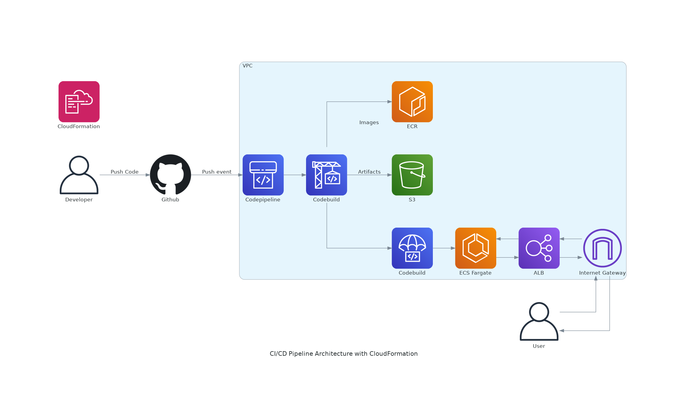

### CI/CD Pipeline Architecture with CloudFormation



#### 1. Architecture Explanation

This architecture outlines a CI/CD pipeline for deploying a Node.js TypeScript application using AWS services. Here's a detailed explanation of each component and their interactions as depicted in the diagram:

1. **Developer**: The process begins with the developer, who pushes code changes to a GitHub repository.

2. **GitHub**: The GitHub repository receives the code push event, which triggers the CI/CD pipeline.

3. **CloudFormation**: Manages the entire infrastructure within the VPC. It ensures that all resources are provisioned and configured correctly.

4. **VPC (Virtual Private Cloud)**: The core of the infrastructure, containing all the necessary resources for the CI/CD pipeline.

    - **CodePipeline**: The first component within the VPC, it orchestrates the flow of the CI/CD process.
    
    - **CodeBuild**: Responsible for building the application. It creates artifacts and images, which are then stored in S3 and ECR, respectively.
    
    - **CodeDeploy**: Ensures the application is deployed to ECS Fargate correctly.
    
    - **ECS (Elastic Container Service) Fargate**: Runs the Docker containers that host the application.
    
    - **ELB (Elastic Load Balancer)**: Distributes incoming traffic across multiple ECS instances, ensuring high availability.
    
    - **S3 (Simple Storage Service)**: Stores build artifacts created by CodeBuild.
    
    - **ECR (Elastic Container Registry)**: Stores Docker images built by CodeBuild.
    
    - **Internet Gateway**: Provides internet access to the resources within the VPC.

5. **User**: External users access the application through the Internet Gateway and the ALB.

The workflow is as follows:
- The developer pushes code to GitHub.
- The push event triggers CodePipeline, which starts the build process in CodeBuild.
- CodeBuild builds the application, stores artifacts in S3, and Docker images in ECR.
- CodeDeploy ensures the application is deployed to ECS Fargate.
- The application is accessed by users through the ALB and Internet Gateway.

#### 2. Steps to Run and Deploy this Architecture

Follow these steps to deploy the CI/CD pipeline:

1. **Create a Fine-Grained GitHub Token**
    - Generate a personal access token in GitHub with the read permissions to content & webhook of your repository.

2. **Add Parameters to AWS SSM (Systems Manager) Parameter Store**
    - Store the GitHub token and other configuration values in the SSM Parameter Store using the following commands:
    
    ```bash
    aws ssm put-parameter --name ci-cd-nodejs-typescript-github-oauth-token --value "token" --type SecureString
    aws ssm put-parameter --name ci-cd-nodejs-typescript-vpc-id --value "vpc-id" --type String
    aws ssm put-parameter --name ci-cd-nodejs-typescript-subnet-ids --value "subnet-1,subnet-2" --type String
    aws ssm put-parameter --name ci-cd-nodejs-typescript-github-repo-owner --value "your user name" --type String
    aws ssm put-parameter --name ci-cd-nodejs-typescript-github-branch --value "main" --type String
    aws ssm put-parameter --name ci-cd-nodejs-typescript-region --value "ap-south-1" --type String
    ```

    **Create new VPC or use the default**

3. **Run the CloudFormation Templates**
    - Execute the following scripts to set up the ECR repository, ECS cluster, and CI/CD pipeline:

    ```bash
    ./ecr-repository.sh
    ./ecs-cluster.sh
    ./ci-cd-pipeline.sh
    ```

4. **Access the Application**
    - Once the deployment is complete, access the application via the ALB DNS name. The health check endpoint can be accessed at:
    
    ```
    http://<ALB-DNS-Name>/health
    ```

This will confirm that the application is running and accessible through the load balancer.